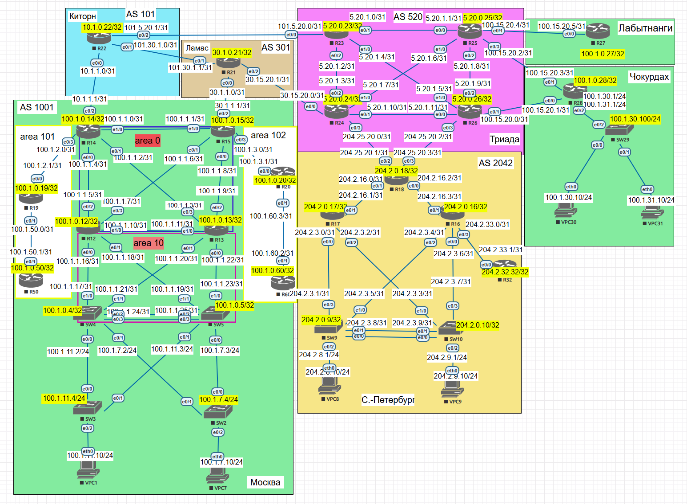

# eBGP. Основы

### Карта сети

#### Цель:

Настроить BGP между автономными системами
Организовать доступность между офисами Москва и С.-Петербург

Описание/Пошаговая инструкция выполнения домашнего задания:

В этой самостоятельной работе мы :

1. Настроим eBGP между офисом Москва и двумя провайдерами - Киторн и Ламас.
2. Настроим eBGP между провайдерами Киторн и Ламас.
3. Настроим eBGP между Ламас и Триада.
4. Настроим eBGP между офисом С.-Петербург и провайдером Триада.
5. Организуем IP доступность между пограничным роутерами офисами Москва и С.-Петербург.

### Настроим eBGP между офисом Москва и двумя провайдерами - Киторн и Ламас.

Сперва настроим eBGP между Москвой и Киторн:

На R14: запустим процесс BGP с номером AS 1001, назначим id-роутера, пропишем адрес loopback, роутера, который решили сделать доступным из интернета, и пропишем единственного соседа из другой AS 101:

На R22: запустим процесс BGP с номером AS 101, назначим id-роутера и пропишем соседей из соседних AS 1001, 520, 301, а также будем редистрибьютить все подключенные сети командой redistribute connected (чтобы не прописывать каждую AS, подключенную к роутеру):

Теперь настроим eBGP между Москвой и ЛАМАСом(AS 301):

сперва на R15 запустим процесс BGP с номером AS 1001, назначим id-роутера, пропишем адрес loopback, роутера, который решили сделать доступным из интернета, и пропишем единственного соседа из другой AS 301:

На R21: запустим процесс BGP с номером AS 301, назначим id-роутера и пропишем соседей из соседних AS 1001, 520, 301, а также будем редистрибьютить все подключенные сети командой redistribute connected (чтобы не прописывать каждую AS, подключенную к роутеру): 

#### Выполнив первое задание, мы выполнили и второе.

Для выполнения третьего задания на роутерах R23 и R24 настроим процесс BGP:

На R23 указываем только одну удаленную AS Киторн(101):

И R24 Указываем обе присоединенные AS 2042(Санкт Петербург) и 301 (Ламас):

#### Выполним четвертое задание настроив связность Триады и Сю-Петербурга, попутно выполнив Пятое задание:

На R18: запустим процесс BGP с номером AS 2042, назначим id-роутера, пропишем адрес loopback, роутера, который решили сделать доступным из интернета, и пропишем единственного ДЕЙСТВУЮЩЕГО соседа из другой AS 2042:

Проверим таблицы маршрутизации пограничных роутеров С.-Петербурга и Москвы:

 Таблица BGP R18, в которой видим маршруты к роутеру R 14 и R15:

проверим также их доступность:

На R14 видим что маршрут к роутеру R15 в таблицу маршрутизации ИПЗ не попал, т.к. роутеры находятся в одной AS 1001:

и на R15:

