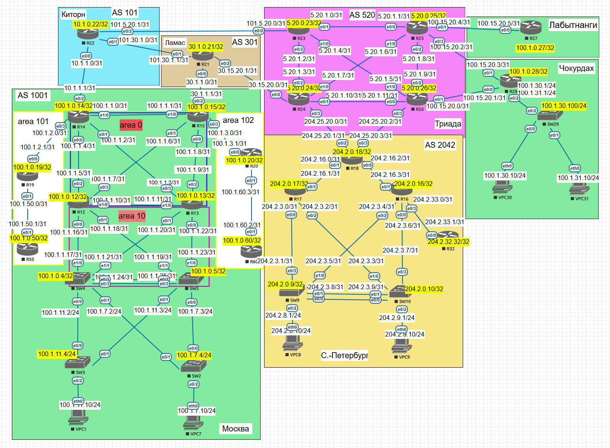

# BGP. Фильтрация

### Карта сети

#### Цель:

Настроить фильтрацию для офисе Москва
Настроить фильтрацию для офисе С.-Петербург

#### Описание/Пошаговая инструкция выполнения домашнего задания:

В этой самостоятельной работе мы ожидаем, что вы самостоятельно:

1. Настроим фильтрацию в офисе Москва так, чтобы не появилось транзитного трафика(As-path).
2. Настроим фильтрацию в офисе С.-Петербург так, чтобы не появилось транзитного трафика(Prefix-list).
3. Настроим провайдера Киторн так, чтобы в офис Москва отдавался только маршрут по умолчанию.
4. Настроим провайдера Ламас так, чтобы в офис Москва отдавался только маршрут по умолчанию и префикс офиса С.-Петербург.

#### 1. Настроим фильтрацию в офисе Москва так, чтобы не появилось транзитного трафика(As-path).

Для этого создадим as-path access-list, в котором укажем отбор AS-Path только маршрутов, оригинированных AS-1001(as, в которой располагаются роутеры R14 и R15). Затем применим правило разрешения прохождения трафика посредством route-map, и наконец применим это правило на исходящий к соседу(R22 Киторн) трафик.

Обратим внимание, что на R14 приходит только маршрут по умолчанию от R22 (провайдер Киторн, выполнив тем самым сразу **третье задание**), выполнили мы Это задание создав префикс лист, который пропускает только один маршрут (по умолчанию 0.0.0.0./0) и назначили этот лист на уходищий трафик к соседу R14:

Тоже самое, что и на R 14 сделаем на R15 и попутно выполним **четвертое задание**(добавив префикс лист, как на R22)

 R21:

Для выполнения третьего задания можно ничего не настраивать, но мы выполним защиту от дурака, добавив соответствующие префикс листы на исходящий трафик к обоим соседям: 

Проблему с маршрутом по умолчанию в AS2045 удалось решить так:

 сначала на R16 увеличил Distance  для маршрута 0.0.0.0/0 c 5 до 250 

Командой:  

R16(config-router-af-topology)#summary-metric 0.0.0.0/0 distance 

а затем создал маршрут по умолчанию в NULL0 на R18, добавил трансляцию подсети 0.0.0.0/32 в трансляцию eigrp. Теперь мы имеем во всей сети маршрут по умолчанию на устройствах с distans metric 90.

IP - связность сетей присутствует:

