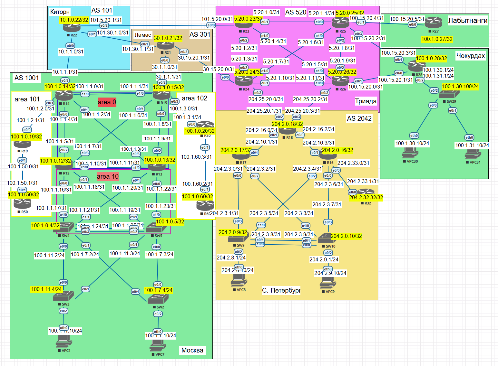
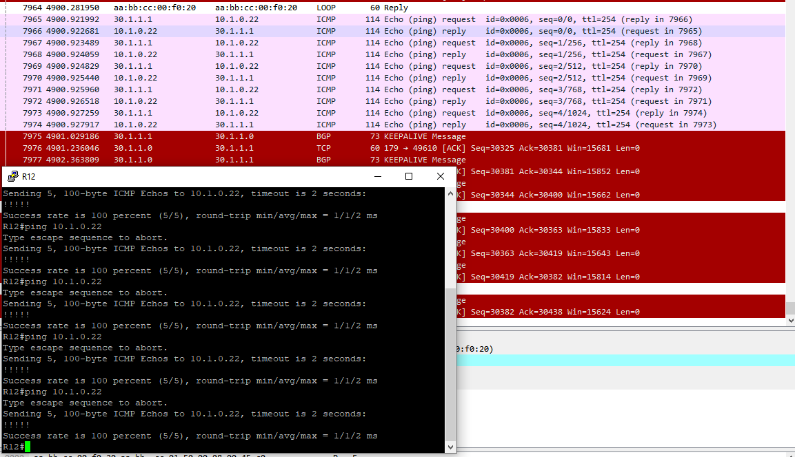
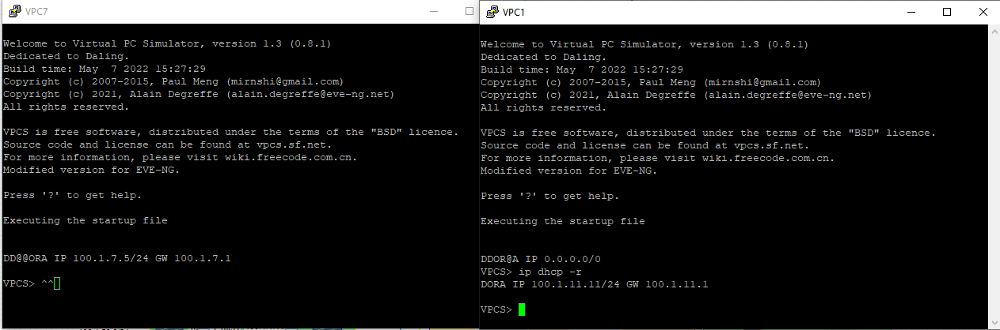
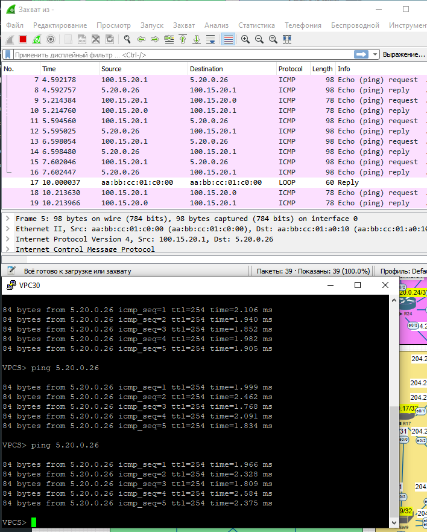
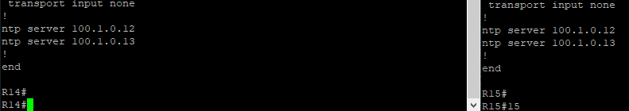

# Основные протоколы сети интернет

#### Карта сети

#### Цель:

Настроить DHCP в офисе Москва
Настроить синхронизацию времени в офисе Москва
Настроить NAT в офисе Москва, C.-Перетбруг и Чокурдах

#### Описание/Пошаговая инструкция выполнения домашнего задания:

В этой самостоятельной работе мы самостоятельно:

1. Настроим NAT(PAT) на R14 и R15. Трансляция должна осуществляться в адрес автономной системы AS1001.
2. Настроим NAT(PAT) на R18. Трансляция должна осуществляться в пул из 5 адресов автономной системы AS2042.
3. Настроим статический NAT для R20.
4. Настроим NAT так, чтобы R19 был доступен с любого узла для удаленного управления.
5. Настроим для IPv4 DHCP сервер в офисе Москва на маршрутизаторах R12 и R13. VPC1 и VPC7 должны получать сетевые настройки по DHCP. Настроим статический NAT(PAT) для офиса Чокурдах.
6. Настроим NTP сервер на R12 и R13. Все устройства в офисе Москва должны синхронизировать время с R12 и R13.
7. Все офисы в лабораторной работе должны иметь IP связность.
 

#### 1. Настроим NAT(PAT) на R14 и R15. Трансляция должна осуществляться в адрес автономной системы AS1001.

Для выполнения задания, нам потребуется настроить NAT на роутерах R14 и R15, настройки будут идентичными, поэтому рассмотрим пример настройки на роутере R14. 

Для начала, нам нужно сделать отбор адресного пространства, которое мы будем натировать, с помощью ACL:
    
    ip access-list extended LAN
     permit ip 100.1.0.0 0.0.255.255 any
     deny   ip any any

Мы выбрали все адресное пространство AS 1001 для натирования. Затем обозначим направления натрования на портах: 
на интерыейсах, которые подключены к внутренней сети 100.1.0.0(которую будем натировать): 

        int ra e0/0-1, e0/3, e1/0
         ip nat inside

       
на интерфейсах, которые подключены к внешней сети 10.1.1.1:

        int e0/2
         ip nat outside

затем создадим Route-Map - правило, выбора сети и интерфейса для натирования:

        route-map NAT_TO_KITORN permit 10
         match ip address LAN
         match interface Ethernet0/2

теперь создадим омновнове правило натирования сети:

        ip nat inside source route-map NAT_TO_KITORN interface Ethernet0/2 overload

Согласно вышеизложенному правилу, у нас будет натроваться весь трафик из сети 100.1.0.0 255.255.0.0 проходящий через интерфейс e/02 в ip- адрес 10.1.1.1

Убедимся, что NAT работает(сделаем ping с R12 к R22):

#### 2. Настроим NAT(PAT) на R18. Трансляция должна осуществляться в пул из 5 адресов автономной системы AS2042.

Для выполнения этого задания мы с помощью ACL выберем адресное простраство, которое будем натировать, создадим пул и напишем правило ната:

        ip nat pool FOR_NAT 204.2.204.1 204.2.204.5 netmask 255.255.255.0
        ip nat inside source list NETWORK_FOT_NAT pool FOR_NAT overload
        !
        ip access-list extended NETWORK_FOT_NAT
        permit ip 204.2.0.0 0.0.63.255 any

### 3. Настроим статический NAT для R20.

Создадим на R15:
                interface Loopback1
                 ip address 100.1.255.20 255.255.255.255
                 ip virtual-reassembly in
                 ip ospf 1 area 102

Настроим BGP на R15 

                 router bgp 1001
                 bgp router-id 100.1.0.15
                 bgp log-neighbor-changes
                network 100.1.0.12 mask 255.255.255.255
                network 100.1.0.14 mask 255.255.255.255
                network 100.1.0.15 mask 255.255.255.255
             !!!  network 100.1.255.20 mask 255.255.255.255

напишем правило на R15:

                ip nat inside source static 100.1.0.20 100.1.255.20

### 4. Настроим NAT так, чтобы R19 был доступен с любого узла для удаленного управления.

Для этого, на линках, смотрящих на встречу R14 и R15 пропишем:

                ip nat Outside

а на R14 добавим правило для проброса порта к SSH на R19:

                ip nat inside source static tcp 100.1.0.19 22 100.1.0.14 2221 extendable

а на R19 настроим доступ через ssh:

                line vty 0 4
                 logging synchronous
                 login local
                 transport input ssh

        crypto key generate rsa general-keys 
        2048

### 5. Настроим для IPv4 DHCP сервер в офисе Москва на маршрутизаторах R12 и R13. VPC1 и VPC7 

на R12 настроим:

        ip dhcp excluded-address 100.1.7.0 100.1.7.4
        ip dhcp excluded-address 100.1.11.0 100.1.11.4
        ip dhcp excluded-address 100.1.11.128 100.1.11.255
        ip dhcp excluded-address 100.1.7.128 100.1.7.255
        !
        ip dhcp pool OFFICE_11
        network 100.1.11.0 255.255.255.0
         default-router 100.1.11.1
         dns-server 100.1.11.1
         netbios-name-server 100.1.11.1
        !
        ip dhcp pool OFFICE_7
         network 100.1.7.0 255.255.255.0
         default-router 100.1.7.1
         dns-server 100.1.7.1
         netbios-name-server 100.1.7.1

На R13:

ip dhcp excluded-address 100.1.7.253 100.1.7.255
ip dhcp excluded-address 100.1.11.253 100.1.11.255
ip dhcp excluded-address 100.1.7.1 100.1.7.127
ip dhcp excluded-address 100.1.11.1 100.1.11.127
!
ip dhcp pool OFFICE_11
 network 100.1.11.0 255.255.255.0
 default-router 100.1.11.1
 dns-server 100.1.11.1
 netbios-name-server 100.1.11.1
!
ip dhcp pool OFFICE_7
 network 100.1.7.0 255.255.255.0
 default-router 100.1.7.1
 dns-server 100.1.7.1
 netbios-name-server 100.1.7.1

Проверим получение компьютерами IP-адресов:

Настроим статический NAT(PAT) для офиса Чокурдах:

        ip nat inside source route-map ISP_TO_R25 interface Ethernet0/1 overload
        ip nat inside source route-map ISP_TO_R26 interface Ethernet0/0 overload
        !
        ip access-list extended FOR_NAT
         permit ip 100.1.30.0 0.0.0.255 any
         permit ip 100.1.31.0 0.0.0.255 any
        deny   ip any any
        !
        route-map ISP_TO_R25 permit 10
         match ip address FOR_NAT
         match interface Ethernet0/1
        !
        route-map ISP_TO_R26 permit 10
         match ip address FOR_NAT
        match interface Ethernet0/0

### 6. Настроим NTP сервер на R12 и R13. Все устройства в офисе Москва должны синхронизировать время с R12 и R13.

На R13:

        ntp master 4
        ntp server 5.20.0.24
        ntp server 100.1.0.12

На R12:

        ntp master 4
        ntp server 5.20.0.24
        ntp server 100.1.0.13

